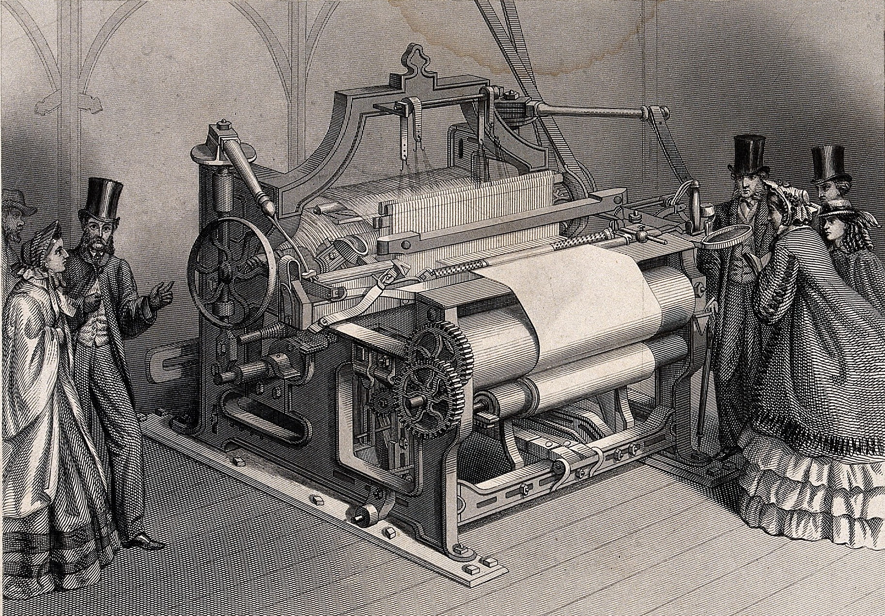
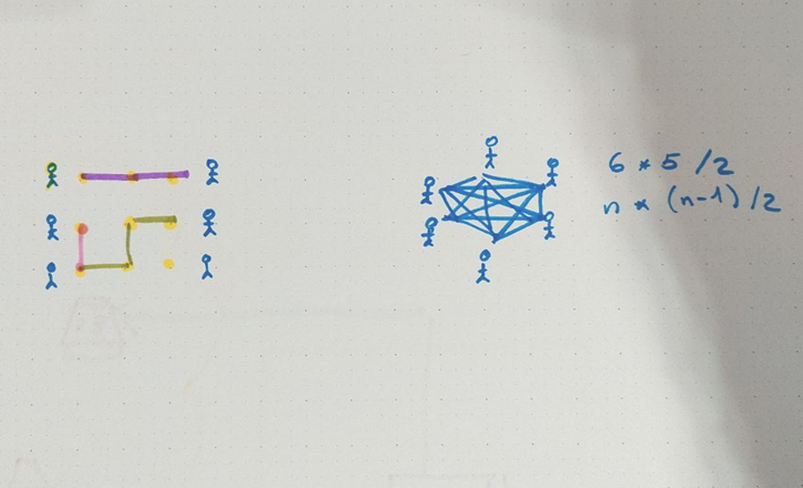
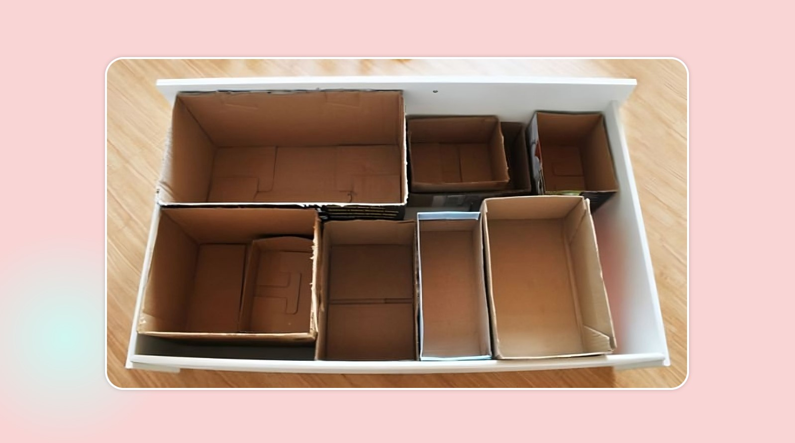
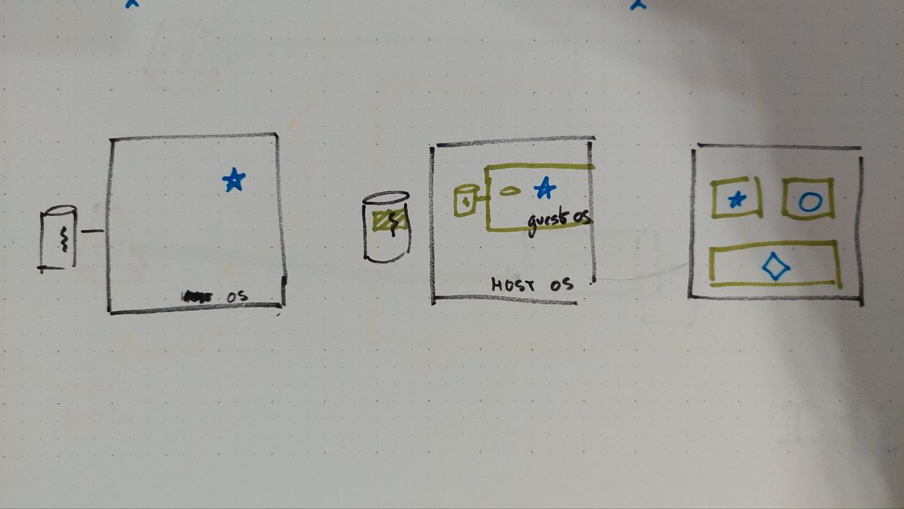
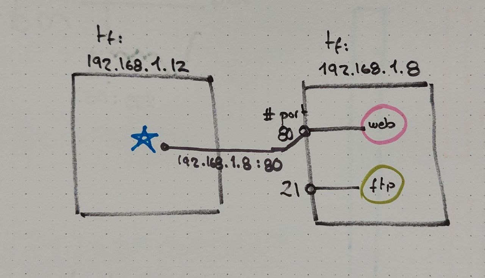
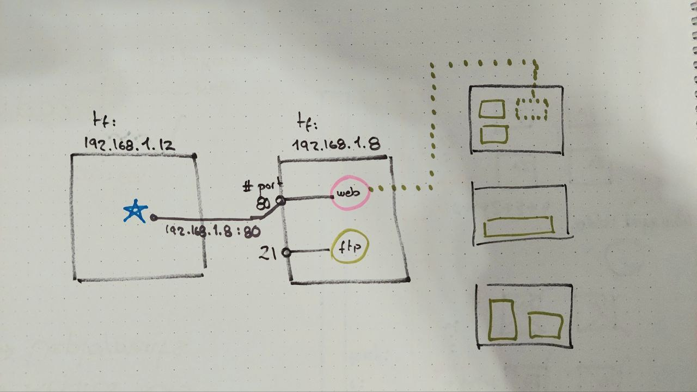
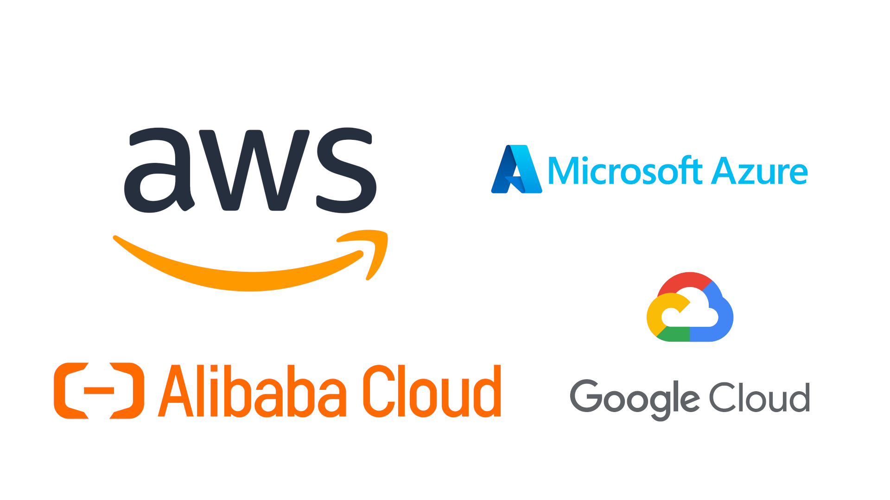

# DevSecOps in public cloud

Public cloud is an strategic tool for **improving agility** in the application of software
to promote competitiveness in our companies. But moving code to production much faster
is not useful if we loose reliability during the way or if we **compromise the security**
of our people and assets.

::: Notes

The plane crossing the sky is a clear **metaphor** of what we are aiming for: extreme
velocity in a highly controlled development framework.

:::

## Traditional loom

*Weaving fabric is an ancient practice that spans both time and culture. In Maya civilization, the goddess Ixchel taught the first woman how to weave at the beginning of time.*

*The loom threads across the globe from China to Colombia, and dates back to as early as **Ancient Egypt in 4400 BC**. Through centuries, the loom evolved to be the titan of all fabric creation.*

[History of the Loom](https://marylana.com/blogs/news/history-of-the-loom-know-how-your-clothes-are-made)

::: Notes

The traditional loom is a **metaphor** of what happens when you are used to run
your business/servers in a particular way, and how difficult is to change that.

:::

## Industrial revolution

*The first power loom was designed in **1786** by Edmund Cartwright and first built that same year. It was refined over the next **47** years until a design by the Howard and Bullough company made the **operation completely automatic**.* 

[Wikipedia, Power loom](https://en.wikipedia.org/wiki/Power_loom)

A similar process is happening with infrastructure administration at all levels, including security.

We are going to talk about how to developers, security teams and the operation staff
can work together in a fast and reliable way, thanks to automation.

::: Notes

* Scaling by automating
* DIfferent skills required

:::

## Networking virtualization

* It is possible to use a fixed infrastructure to provide dynamic configurations
* An early example, at network level, was the cable wiring machines used to stablish phone communications

::: Notes

Draw a graph of six people and then connect them all. You will get n*(n-1)/2 relations.

Now draw the six persons with a dotted matrix (of 3x3, for example) and paint some
dynamic connections between any random pair of people.

:::

## Compute virtualization

* Operating systems are just applications that manages other applications and hardware resources
* It is possible to execute a guest operating system inside a host one
* The host operating system can provide isolation between workloads run inside the guest operating systems

This is very similar to the tactic that we use when we put a set of boxes in a drawer to avoid
mixing all the staff together.

::: Notes

Introduce the concept of HTTPs server, including:

* Virtual machines

:::

## How applications ring each other

::: Notes

* Applications connected to the network
* IP addresses, as the telephone number of a device
* Ports, as a way to address a particular application

:::

## The Cloud

* It is a Data Center with **automation** capabilities to create **dynamic configurations**
* Provides an open **Application Program Interface** for accessing those capabilities
* The use can be exclusive for a particular entity (**private**) or multi-tenant (**public**)

::: Notes

Explain the concept of API server, API call and programable infrastructure.

:::

## Hyperscalers

::: Notes

* Describe the main characteristics of each one of those providers.
* Talk about what hyperscale mean (global footprint, real capacity)

## Lab: exploring the default network

## Lab: launching a server

## Lab: creating a brand new network

## Lab: detecting security problems in the code

## Imperative vs...

## ...vs declarative

## Lab: advanced automated security testing

## Lab: declaratively deploying a data center

## Lab: declaratively updating existing resources

## Pipeline automation

::: Notes

Link this photography to the loom with which we started the explanation!

:::

